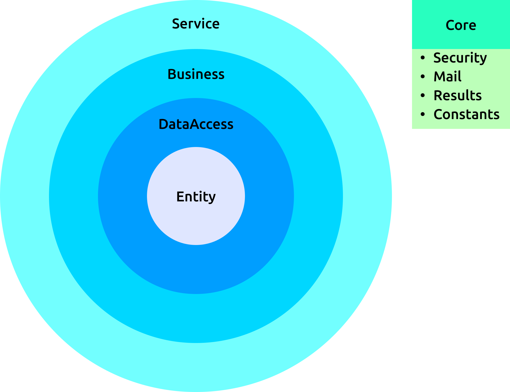

# Social media app

The web service of this application is developed with Monolithic architecture using .Net Core Web API, frontend with react and admin panel with react-admin.

The main purpose of this project is to develop a fully functional, architecturally advanced, web service developed in accordance with clean code.

This application is designed as a social media platform that only university students can use, and is currently only open to university students with university e-mail addresses affiliated with universities, faculties and departments in Turkey, but those who want to visit the application can use it as a visitor.

Since client and admin applications outside of the web service are designed to provide a user-friendly interface only for the client, documentation can only be found for the web service, not for these applications. User interfaces are designed in Turkish for Turkish users. English language support may be added in the future.

# Technologies 

For API, I used .Net Core Web API and several nuget packages along with it. Here is complete list.

- .Net 6
- MySQL
- Entity Framework Core
- AutoFac
- AutoMapper
- FluentValidation
- NLog

For client, I used React as a UI Library and some other npm packages.

- react
- redux
- reselect
- react-router-dom
- axios

In addition I use react-admin for admin panel.

# Architecture

The web service is basically designed using onion architecture. In addition to this architecture, clean code principles such as the DRY principle have been tried to be applied as much as possible.




### Core

The Core class library contains common code that is used in common with other libraries. Helps other classes with classes such as Security, Results, Mail, Contants

### Entity

The Entity class library is a reflection of the tables used in the database. In addition, the necessary configurations for AutoMapper and Dto (Data Transfer Object) classes can be found in this library.

### Data Access

The Data Access class library manages the operations of classes offered with Entity on the database. In addition, DbContext and Entity classes required for Entity Framework are mapped to the database in this library and necessary relations are determined. In addition, data seeding is done in this library.

### Business

Business library enforces business rules and requests from API Controllers are processed. Here, database operations created in the Data Access library are used with DI (Dependency Injection). Also, Dependency Resolving with AutoFac is done in this library.

### Service

Service is a .Net Core Web API application and provides a UI that can be accessed by URL to the application. Controller classes transfer the requests to the Business layer and perform the necessary log operations. Middlewares are implemented here, for example JWT configurations are made here.


# Deployment

Thanks to Docker, all services and database can be deployed separately. You can quickly deploy the application using docker compose for deployment. The user interface can be accessed at http://localhost:3000 and the web service at http://localhost:80. We invite you to review the docker compose file to take a look at the env variables and all other settings used in the applications.

```bash

docker-compose build
docker-compose up

```

> Warning. Thanks to Docker compose, the web service and the database are run separately. However, Entity Framework, which is the ORM used in the web service, has great difficulties in migrating under docker enviroment. The most reasonable solution here (for me) is to: 
> 
> - run the containers with docker-compose,
> - connect to the running mysql database with `localhost:3306 root 12345678` informations,
> - run the database creation script with the command `dotnet ef migrations script --project ./DataAccess` in the service folder,
> - execute the script in the mysql. Since you keep the file location of the database in the mysql/ file at the root of the project, you only need to run this command once.

# Development

- Run API

```bash

cd service 
dotnet build # onyl once in the directory
dotnet watch run --project ./Service --launch-profile "Development"

```

- Run react client

```bash

cd client
npm start

```

- Run admin ui

```bash

cd admin
npm start

```